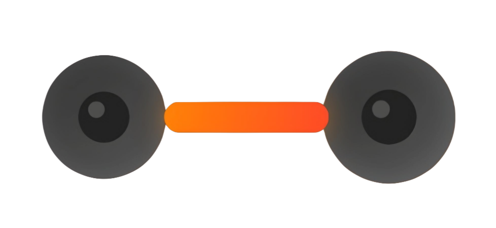

# FitFuture - Gym Training Website



## Overview

FitFuture is a modern, responsive website for a professional gym training service. The site features a sleek, futuristic design with interactive elements and smooth animations to engage visitors and showcase training programs, trainer profiles, client transformations, and online coaching services.

## Features

- **Interactive UI**: Smooth animations, transitions, and hover effects
- **Responsive Design**: Fully mobile-responsive layout
- **Program Showcase**: Visual presentation of training programs
- **Trainer Profiles**: Dedicated section for trainer information
- **Client Transformations**: Before/after photos showcasing client success
- **Online Coaching**: Detailed information about personalized online coaching programs
- **Contact Form**: Direct way for potential clients to get in touch
- **Smooth Scrolling**: Enhanced user navigation experience

## Pages

1. **Home Page**: Features hero section, training programs, trainer profiles, testimonials, and contact form
2. **Online Coaching**: Detailed information about customized training plans and nutritional guidance

## Technology Stack

- **Frontend**: React.js with Vite
- **Styling**: Tailwind CSS with custom CSS for advanced animations
- **Animation**: Framer Motion for smooth interactive animations
- **Routing**: React Router for page navigation
- **State Management**: React hooks (useState, useEffect)
- **Intersection Observer**: For scroll-based animations
- **Font Icons**: Font Awesome for UI icons
- **Form Handling**: Connected to Google Forms

## Installation

1. Clone the repository
```bash
git clone https://github.com/your-username/gym-trainer-website.git
cd gym-trainer-website
```

2. Install dependencies
```bash
npm install
```

3. Start the development server
```bash
npm run dev
```

4. Build for production
```bash
npm run build
```

## Project Structure

```
GYM-TRAINER-WEBSITE/
├── public/
│   └── images/                # Public images including trainer photos
├── src/
│   ├── components/            # React components
│   │   ├── Contact.jsx        # Contact form component
│   │   ├── Footer.jsx         # Website footer
│   │   ├── Hero.jsx           # Hero section component
│   │   ├── Navbar.jsx         # Navigation bar component
│   │   ├── OnlineCoaching.jsx # Online coaching page
│   │   ├── Reviews.jsx        # Client testimonials/transformations
│   │   ├── Services.jsx       # Training programs showcase
│   │   ├── SplashScreen.jsx   # Initial loading screen
│   │   └── Team.jsx           # Trainer profiles section
│   ├── App.jsx                # Main application component
│   └── main.jsx               # React entry point
├── css/
│   ├── style.css              # Main stylesheets with custom styles
│   ├── cursor.css             # Custom cursor effects
│   └── splash.css             # Splash screen styles
├── js/
│   └── main.js                # Custom JavaScript functionality
├── index.html                 # Main HTML entry point
├── package.json               # Project dependencies and scripts
└── vite.config.js             # Vite configuration
```

## Customization

- **Trainers**: Edit the `teamMembers` array in `Team.jsx` to update trainer information and photos
- **Programs**: Modify the `services` array in `Services.jsx` to change the training programs
- **Testimonials**: Update the `reviews` array in `Reviews.jsx` to add/edit client testimonials
- **Colors**: Modify color variables in `css/style.css` to update the site's color scheme
- **Contact**: Update the email and phone information in `Footer.jsx`

## Deployment

The site is built with Vite and can be easily deployed to various platforms:

```bash
# Build the project
npm run build

# Preview the production build locally
npm run preview
```

The built files will be in the `dist` directory, ready to be deployed to your hosting service of choice.

## Credits

- Design & Development: Himsara De Costa
- Trainers: Himsara De Costa & Achintha Prabash
- Images: Unsplash (placeholders)

## License

This project is licensed under the MIT License - see the LICENSE file for details.

## Contact

For inquiries, please contact:
- Email: himsaradecosta@gmail.com
- Phone: +94 (71) 228-1369
